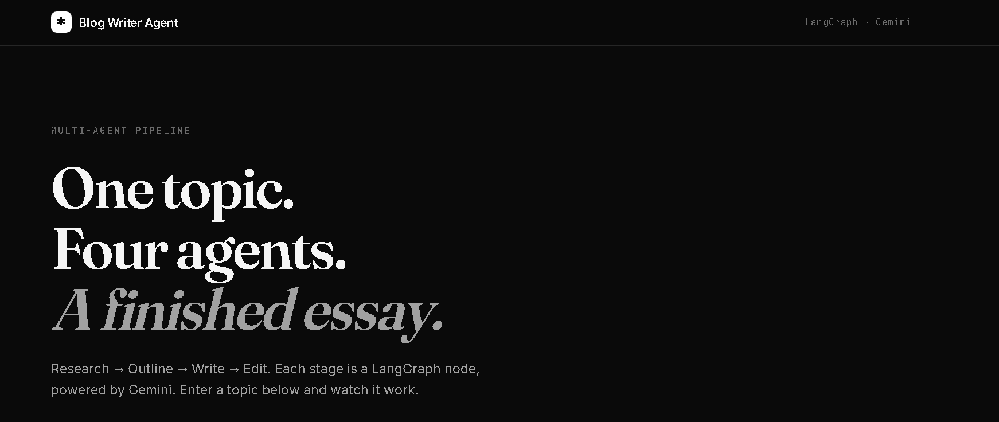

# ✍️ Blog Writer Agent



A **multi-agent AI system** that researches, outlines, writes, and edits a full
blog post from a single topic input. Built with **LangGraph**, **LangChain**,
and **Google Gemini**.

**🔗 Live demo:** https://aideejames.github.io/blog-writer-agent/  
**🔗 API docs:** https://blog-writer-agent-api.onrender.com/docs

> 🔒 Password-protected demo — contact me for access.  
> ⏳ Backend runs on Render's free tier — the first request may take 30–60 seconds to wake up.

---

## What it does

Enter a topic. Four agents run in sequence and return a polished blog post
(~700–1000 words) in about 30–60 seconds.

| Stage | Agent | Role |
|---|---|---|
| 1 | **Researcher** | Produces key concepts, angles, misconceptions, and a hook idea |
| 2 | **Outliner** | Builds a structured outline with title, thesis, and 4–6 sections |
| 3 | **Writer** | Writes the full blog post from the outline |
| 4 | **Editor** | Polishes prose, tightens wordy sentences, fixes transitions |

Each stage is a **node in a LangGraph `StateGraph`**, communicating through a
shared `BlogState` dictionary.

---

## Why multi-agent?

A single LLM prompt like *"write a blog post about X"* produces generic,
unstructured output. Splitting the task into narrow roles gives each stage a
tight, well-defined brief — which produces significantly better results.

Two design principles:

- **Each node returns only what it changed.** LangGraph merges the partial update
  into the shared state. The researcher returns `{"research": text}`, not the
  whole state.
- **The editor's brief is deliberately narrow.** It polishes — it does not
  rewrite. Without that constraint, LLMs tend to discard the writer's work and
  introduce factual drift.

---

## Stack

| Layer | Tool |
|---|---|
| Orchestration | [LangGraph](https://github.com/langchain-ai/langgraph) |
| LLM framework | [LangChain](https://github.com/langchain-ai/langchain) |
| Model | Google Gemini (`gemini-2.5-flash`) |
| Backend | FastAPI + Uvicorn |
| Frontend | Vanilla HTML / CSS / JS |
| Deployment | Render (backend) + GitHub Pages (frontend) |

---

## Project structure

```
.
├── .github/
│   └── workflows/
│       └── pages.yml          GitHub Pages deploy workflow
├── backend/
│   ├── agent.py               LangGraph pipeline (4 nodes)
│   ├── main.py                FastAPI wrapper
│   ├── requirements.txt
│   └── .env                   Local only — never committed
├── frontend/
│   ├── index.html
│   ├── style.css
│   └── script.js
├── docs/
│   └── screenshot.png
├── render.yaml                Render deployment config
└── README.md
```

---

## Run locally

### 1. Clone and install

```bash
git clone https://github.com/Aideejames/blog-writer-agent.git
cd blog-writer-agent/backend
pip install -r requirements.txt
```

### 2. Add your API key

Create `backend/.env`:

```env
GOOGLE_API_KEY=your-gemini-api-key-here
GEMINI_MODEL=gemini-2.5-flash
DEMO_PASSWORD=changeme      # optional — remove or leave blank for open access
```

Get a free Gemini API key at https://aistudio.google.com/app/apikey.

### 3. Start the API

```bash
python -m uvicorn main:app --reload
```

API docs at **http://127.0.0.1:8000/docs**

### 4. Open the frontend

Open `frontend/index.html` in a browser. It calls the local API.

---

## API

Deployed at: **https://blog-writer-agent-api.onrender.com**

### Interactive docs

👉 https://blog-writer-agent-api.onrender.com/docs

### Example call

```bash
curl -X POST https://blog-writer-agent-api.onrender.com/generate \
  -H "Content-Type: application/json" \
  -H "x-demo-password: your-password" \
  -d '{ "topic": "Why sleep matters for developers" }'
```

### Response

```json
{
  "topic": "Why sleep matters for developers",
  "research": "...",
  "outline": "...",
  "draft": "...",
  "final_post": "..."
}
```

### Endpoints

| Method | Path | Purpose |
|---|---|---|
| `GET` | `/` | API greeting + model name |
| `GET` | `/health` | Health check |
| `POST` | `/generate` | Run the 4-agent pipeline for a topic |

---

## Deployment

### Backend (Render)

1. Push to GitHub
2. Render → **New +** → **Blueprint** → connect the repo
3. Add environment variables: `GOOGLE_API_KEY`, `DEMO_PASSWORD`, `GEMINI_MODEL`
4. Deploy

### Frontend (GitHub Pages)

1. Settings → Pages → Source: **GitHub Actions**
2. The `.github/workflows/pages.yml` workflow deploys `frontend/` automatically on every push to `main`

---

## License

MIT — see [LICENSE](LICENSE).

---

## Author

**Idara Joshua James**  
GitHub: [@Aideejames](https://github.com/Aideejames)